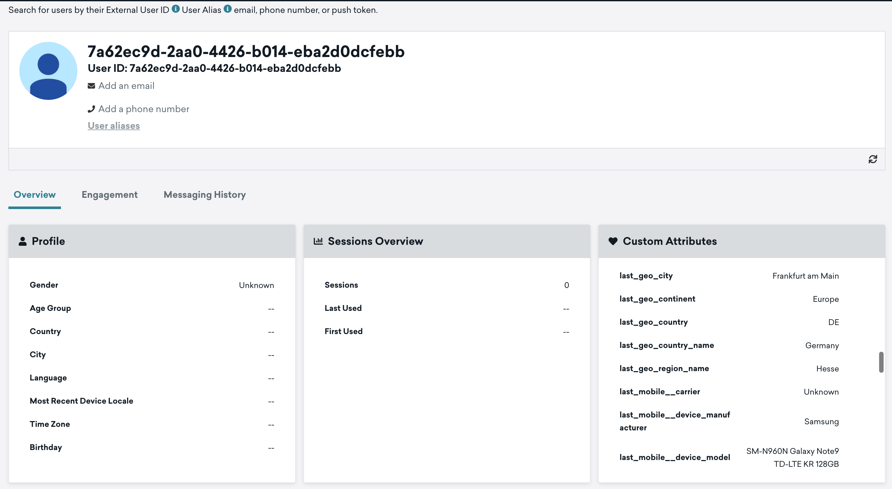

[![maintained]][tracker-classification]
[![License][license-image]][license]
[![Discourse posts][discourse-image]][discourse]


# Snowplow's dbt example project - Braze Users Sync

The purpose of this project is to show how you could use Snowplow's Unified package and Braze's `Cloud Data Ingestion` to create a sync between the `snowplow_unified_users` table and Braze.

## Usage

You will find an example dbt project to illustrate how you would go about setting this up on your own.

### Pre-requisites

As per usual, you would need to prepare your dbt project for the snowplow-unified package to work properly: adding the latest [snowplow-unified](https://hub.getdbt.com/snowplow/snowplow_unified/latest/) package in the packages.yml file, configuring any variables in your project.yml file that need to be different from the defaults, and copying the selectors.yml from the unified dbt package to your own. For more information on how to do this, follow the modelling section within our [docs](https://docs.snowplow.io/).

The main pre-requisite is basically to have a `working dbt project with the snowplow-unified package` that created the users table in your warehouse.

### How it would work

In short, each time the users table is updated, a dbt snapshot would create the changes on user_identifier level, then the model `snowplow_unified_users_braze_sync` would change the output of the snapshot to a format Braze needs for integration. Then from Braze's side you would need to set up a new Data Sync and schedule it to run and update the changes. [Here](https://www.braze.com/docs/user_guide/data_and_analytics/cloud_ingestion/overview/#how-it-works) you can find a more detailed guide on this.

You would need the following dbt execution flow to happen before your table is ready for the sync:

```yml title="dbt_project.yml"
dbt run --selector snowplow_unified
dbt snapshot
dbt run --select snowplow_unified_users_braze_sync
```

#### snowplow_unified_users_snapshot

You can find an example of how the snapshot would look like (`snowplow_unified_users_snapshot`). It uses the recommended `timestamp_strategy` and naturally takes the user_identifier as the `unique_key`, and the `model_tstamp` as the `updated_at` field. The model_timestamp is updated as part of the incremental users table update, it suits perfectly for signalling to the snapshot which rows have been updated in the latest run.

In the first run dbt takes all the fields the users table has and adds 4 more to the end: `dbt_scd_id`, `dbt_updated_at`, `dbt_valid_from`, `dbt_valid_to`. The `dbt_updated_at` will basically be the model_timestamp and the `dbt_valid_from` should be the same for these currently valid records. The `dbt_valid_to` stays null indicating that these are the latest values. 

Any subsequent run produces an incremental update to the snapshot whereby if any record changes for the particular user, the previously valid row will be updated with a `dbt_valid_to` value and a new row with the latest values will be added. This forms the base for the sync. For more information on this approach (Type 2) of capturing slowly changing dimensions check out [dbt docs](https://docs.getdbt.com/docs/build/snapshots) on snapshots.

#### snowplow_unified_users_braze_sync

In essence we need to transform the user level data changes into the format that is needed for Braze, a table/view with the following three columns:

- updated_at
- external_id
- payload

The updated_at timestamp column will basically tell Braze when the row was last updated, this will be the `dbt_updated_at` field (aka the model_tstamp from the users table). We use current_timestamp() when creating the model_timestamp, in line with Braze's recommendation to use UTC for this column.

The `external_id` needs to be the unique user identifier, in this case this is the same throughout, the user_identifier.

The `payload` is a JSON string which lists all the values for the columns from the snowplow_unified.users table that are needed for the sync. These will be updating the user attributes in Braze.

There are several considerations to be taken into account when creating this transformation: 

1. Which columns need to be synced?

    To illustrate some of the options to go about this we added the vars `snowplow__braze_columns_to_include`: [] and `snowplow__braze_columns_to_exclude`: [] to the example project and added the relevant logic into the braze sync model. 
    
    Essentially the easiest way to go about it is if you explicitly list all the fields that need to be part of the sync using the `snowplow__braze_columns_to_include` array. This way you will be reducing the upfront calculations, the payload and have less chance to run into Braze's limitations. Making the list explicit would also make it easier to follow what is part of the sync and what isn't and would probably be easier to handle as your table will ultimately keep changing, new columns being added etc. 

    Alternatively, you could take all the fields from the users table and only list columns to exclude from the sync using the `snowplow__braze_columns_to_exclude` array. In the code you will see that the 4 extra snapshot added columns are excluded in any case: `dbt_scd_id`, `dbt_updated_at`, `dbt_valid_from`, `dbt_valid_to`. It also makes sense as a minimum to exclude user_identifier as these will anyway be added as the external_id. This is the id you will use to find the users in braze after the integration.

2. Sending reduced payload vs entire columns

    To minimize consumption Braze recommends minimizing data to be synced. As we use the dbt_updated_at field we already make sure that Braze doesn't do a full sync each time on all the user data. However, for the best optimizations you could calculate which columns have changed since the last run and only send those changes instead of all the column values. We have added the variable `snowplow__braze_column_based_sync` to illustrate two ways of sending data. 

    When enabled, it does more in-depth upfront calculations and only constructs the information that needs to be sent for the sync. In this case the `snowplow__braze_column_based_sync` will become an incremental table and the changes between the previous and the current run will be compared each time the dbt package is run.

    In some cases perhaps it enough to compare changes on a row-by-row level and send the information generated by the users table (snapshot) directly. In this case it is enough to create this model as a view and filter on all the rows from the snapshot where the `dbt_valid_to` is null. Then regardless of how many times a sync is run, it will only show the latest user data but still only the rows that were modified/added since the last sync will be taken into account.
    
### Setting up the Braze sync

Follow [this](https://www.braze.com/docs/user_guide/data_and_analytics/cloud_ingestion/integrations) detailed guide on how to prepare your warehouse for the sync then schedule a run and make sure all your user data is successfully synced.

If all was successful you should be able to search based on an external_id (user_identifier) from within Users and verify the latest attributes:




# Join the Snowplow community

We welcome all ideas, questions and contributions!

For support requests, please use our community support [Discourse][discourse] forum.

If you find a bug, please report an issue on GitHub.

# Copyright and license

The dbt-example-project repository is Copyright 2023-present Snowplow Analytics Ltd.

Licensed under the [Snowplow Community License][license] (the "License");
you may not use this software except in compliance with the License.


[license]: https://docs.snowplow.io/community-license-1.0/
[license-image]: http://img.shields.io/badge/license-Snowplow--Community--1-blue.svg?style=flat

[website]: https://snowplow.io/
[snowplow]: https://github.com/snowplow/snowplow
[docs]: https://docs.snowplow.io/

[tracker-classification]: https://docs.snowplow.io/docs/collecting-data/collecting-from-own-applications/tracker-maintenance-classification/
[early-release]: https://img.shields.io/static/v1?style=flat&label=Snowplow&message=Early%20Release&color=014477&labelColor=9ba0aa&logo=data:image/png;base64,iVBORw0KGgoAAAANSUhEUgAAABAAAAAQCAMAAAAoLQ9TAAAAeFBMVEVMaXGXANeYANeXANZbAJmXANeUANSQAM+XANeMAMpaAJhZAJeZANiXANaXANaOAM2WANVnAKWXANZ9ALtmAKVaAJmXANZaAJlXAJZdAJxaAJlZAJdbAJlbAJmQAM+UANKZANhhAJ+EAL+BAL9oAKZnAKVjAKF1ALNBd8J1AAAAKHRSTlMAa1hWXyteBTQJIEwRgUh2JjJon21wcBgNfmc+JlOBQjwezWF2l5dXzkW3/wAAAHpJREFUeNokhQOCA1EAxTL85hi7dXv/E5YPCYBq5DeN4pcqV1XbtW/xTVMIMAZE0cBHEaZhBmIQwCFofeprPUHqjmD/+7peztd62dWQRkvrQayXkn01f/gWp2CrxfjY7rcZ5V7DEMDQgmEozFpZqLUYDsNwOqbnMLwPAJEwCopZxKttAAAAAElFTkSuQmCC
[unsupported]: https://img.shields.io/static/v1?style=flat&label=Snowplow&message=Unsupported&color=24292e&labelColor=lightgrey&logo=data:image/png;base64,iVBORw0KGgoAAAANSUhEUgAAABAAAAAQCAMAAAAoLQ9TAAAAeFBMVEVMaXGXANeYANeXANZbAJmXANeUANSQAM+XANeMAMpaAJhZAJeZANiXANaXANaOAM2WANVnAKWXANZ9ALtmAKVaAJmXANZaAJlXAJZdAJxaAJlZAJdbAJlbAJmQAM+UANKZANhhAJ+EAL+BAL9oAKZnAKVjAKF1ALNBd8J1AAAAKHRSTlMAa1hWXyteBTQJIEwRgUh2JjJon21wcBgNfmc+JlOBQjwezWF2l5dXzkW3/wAAAHpJREFUeNokhQOCA1EAxTL85hi7dXv/E5YPCYBq5DeN4pcqV1XbtW/xTVMIMAZE0cBHEaZhBmIQwCFofeprPUHqjmD/+7peztd62dWQRkvrQayXkn01f/gWp2CrxfjY7rcZ5V7DEMDQgmEozFpZqLUYDsNwOqbnMLwPAJEwCopZxKttAAAAAElFTkSuQmCC
[maintained]: https://img.shields.io/static/v1?style=flat&label=Snowplow&message=Maintained&color=9e62dd&labelColor=9ba0aa&logo=data:image/png;base64,iVBORw0KGgoAAAANSUhEUgAAABAAAAAQCAMAAAAoLQ9TAAAAeFBMVEVMaXGXANeYANeXANZbAJmXANeUANSQAM+XANeMAMpaAJhZAJeZANiXANaXANaOAM2WANVnAKWXANZ9ALtmAKVaAJmXANZaAJlXAJZdAJxaAJlZAJdbAJlbAJmQAM+UANKZANhhAJ+EAL+BAL9oAKZnAKVjAKF1ALNBd8J1AAAAKHRSTlMAa1hWXyteBTQJIEwRgUh2JjJon21wcBgNfmc+JlOBQjwezWF2l5dXzkW3/wAAAHpJREFUeNokhQOCA1EAxTL85hi7dXv/E5YPCYBq5DeN4pcqV1XbtW/xTVMIMAZE0cBHEaZhBmIQwCFofeprPUHqjmD/+7peztd62dWQRkvrQayXkn01f/gWp2CrxfjY7rcZ5V7DEMDQgmEozFpZqLUYDsNwOqbnMLwPAJEwCopZxKttAAAAAElFTkSuQmCC
[actively-maintained]: https://img.shields.io/static/v1?style=flat&label=Snowplow&message=Actively%20Maintained&color=6638b8&labelColor=9ba0aa&logo=data:image/png;base64,iVBORw0KGgoAAAANSUhEUgAAABAAAAAQCAMAAAAoLQ9TAAAAeFBMVEVMaXGXANeYANeXANZbAJmXANeUANSQAM+XANeMAMpaAJhZAJeZANiXANaXANaOAM2WANVnAKWXANZ9ALtmAKVaAJmXANZaAJlXAJZdAJxaAJlZAJdbAJlbAJmQAM+UANKZANhhAJ+EAL+BAL9oAKZnAKVjAKF1ALNBd8J1AAAAKHRSTlMAa1hWXyteBTQJIEwRgUh2JjJon21wcBgNfmc+JlOBQjwezWF2l5dXzkW3/wAAAHpJREFUeNokhQOCA1EAxTL85hi7dXv/E5YPCYBq5DeN4pcqV1XbtW/xTVMIMAZE0cBHEaZhBmIQwCFofeprPUHqjmD/+7peztd62dWQRkvrQayXkn01f/gWp2CrxfjY7rcZ5V7DEMDQgmEozFpZqLUYDsNwOqbnMLwPAJEwCopZxKttAAAAAElFTkSuQmCC

[discourse-image]: https://img.shields.io/discourse/posts?server=https%3A%2F%2Fdiscourse.snowplow.io%2F
[discourse]: http://discourse.snowplow.io/
